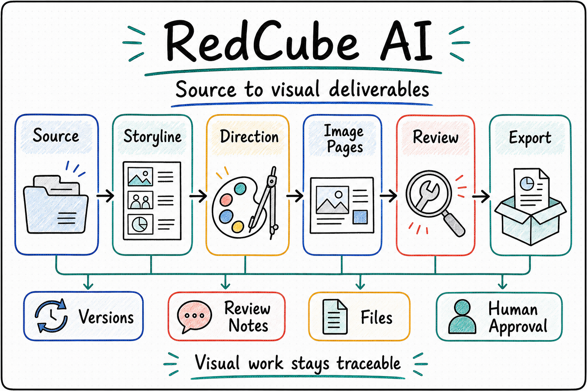

  

# RedCube AI

  <a href="./README.md"><strong>English</strong></a> | <a href="./README.zh-CN.md">中文</a>

<!--
Owner: `RedCube AI`
Purpose: `public_repository_entry`
State: `current_public_entry`
Machine boundary: Human-readable public entry. Machine truth remains in contracts, schemas, source, CLI/MCP/API behavior, runtime artifacts, owner receipts, artifact locators, and RCA-owned review/export gates.
-->

<strong>An AI workspace for formal visual deliverables, keeping source material, drafts, review, revisions, and exported files on one traceable delivery line.</strong>

Slides · Xiaohongshu Notes · Posters

When a task moves from "make a few images" to "produce a visual deliverable I can actually use," the hard part is usually the full workflow, not one page:

- Source material, notes, screenshots, reference images, and old drafts are scattered. How do they become one coherent deliverable?
- After many generated versions, which review comments were addressed, and which version should be rerun?
- Slides, Xiaohongshu notes, and posters need different routes. Can the system choose the right creation path for the deliverable type?
- During longer generation, review, and export runs, can the user still understand what is happening?
- At handoff, can exported files, review records, and source material still match each other?

`RedCube AI` is built around those questions. For knowledge-heavy visual work, it keeps source organization, page generation, review, revision, progress reporting, and export evidence on the same delivery line so a draft can move toward deliverable files.

It does not reduce visual delivery to "generate one image." A usable deliverable often needs several visual directions, layout comparison, missing-material handling, review and repair, and final export checks. RedCube AI keeps those creative decisions and delivery evidence on one line so every revision can explain why it changed and where it landed.

<table>
  <tr>
    <td width="33%" valign="top">
      <strong>Who It Serves</strong> 
      Experts, PIs, educators, and professional teams turning structured knowledge into formal visual deliverables
    </td>
    <td width="33%" valign="top">
      <strong>What It Organizes</strong> 
      Source materials, review comments, reruns, progress updates, and exported files on one traceable delivery line
    </td>
    <td width="33%" valign="top">
      <strong>How To Start</strong> 
      Tell it what you want to make, what source material you already have, and what final file you want to deliver
    </td>
  </tr>
</table>

  

## Core Highlights

**Continuous Creation Around The Deliverable** 
It does not stop at a single generated image. It keeps working around a concrete slide deck, note series, or poster, organizing material, generating pages, absorbing review feedback, and preparing final exports.

**Source To Deliverable In One Workspace** 
Lecture notes, project summaries, references, screenshots, old drafts, and review comments stay on one delivery line for inspection and reuse; runtime artifacts live in the task workspace, not in the source checkout.

**Traceable Review And Revision** 
Each review round, rerun, revision target, and export result stays connected, so operators can see why the current version changed.

**Routes Match The Output Type** 
Slides, Xiaohongshu notes, and knowledge posters use different default routes; editable PPTX and HTML routes are explicit selectable routes.

**Progress Stays Visible During Long Jobs** 
During generation, checking, reruns, and export, RCA progress and review surfaces expose the current step, remaining issues, and the next review focus.

**Room For Visual Exploration And Comparison** 
Formal visual delivery often needs multiple directions, repeated-failure diagnosis, variants, and export checks. RedCube AI does not lock creation into one path; candidates, review, repair, and handoff can continue together.

## One-Sentence Quick Start

You can start with prompts like:

- "Turn these lecture notes and references into a polished teaching deck, keep the progress visible, and export the final PPTX/PDF. If I ask for editable slides, use the native PPTX route."
- "Use this source package to draft a Xiaohongshu note series, tell me what is still missing, and keep each review round traceable."
- "Make a poster from this project summary, track the review comments, and export the final delivery files when the content is ready."

## What It Helps With

- Turning notes, outlines, references, screenshots, and draft fragments into formal slide decks, note series, and poster-style deliverables.
- Keeping multi-round review, reruns, and export checks tied to the same workspace.
- Showing human-readable progress while longer-running jobs continue in the background.
- Delivering exported files that stay connected to their source material and review history; editable PPTX is an explicit route when requested.

## Current Delivery Focus

- `Slides` for teaching decks, academic talks, internal briefings, and formal reports. The current default PPT route is image-first full-slide authoring; HTML and editable native PPTX are explicit selectable routes.
- `Xiaohongshu notes` for knowledge posts, science communication, and serialized publishing. The default route is GPT-Image-2 full-page 3:4 PNG authoring through `author_image_pages`; HTML remains an explicit maintenance route.
- `Knowledge posters` for single-page visual delivery.
- Academic paper and conference poster lanes continue to be evaluated case by case.

## How It Works

- Experts provide the source material, audience expectations, and final judgment.
- The AI operator handles generation, revision, reruns, export, and progress reporting.
- The workspace keeps sessions, review state, rerun history, artifact refs, and export outputs together for inspection.

## Current Boundary

- `RedCube AI` is an independent visual-deliverable Foundry Agent. Its first public identity is visual delivery: source intake, staged visual authorship, review, repair, export, and file handoff.
- The first public surface is the single `redcube-ai` app skill; `Codex`, `OPL`, and other general agents can reach stable capabilities through that skill.
- It can be used as the Presentation Foundry inside One Person Lab, and it can also be called directly by Codex or another agent through stable capability entries.
- RedCube owns material intake, visual generation, review loops, export, and file handoff.
- Content framing, audience fit, and final acceptance stay with experts.
- External publishing and upload steps stay under human supervision.

  
<strong>Technical OPL / executor boundary</strong>

- OPL is the stage-led agent runtime framework that can host RedCube as an external domain agent. Its path is an internal integration / hosted-runtime path, not RedCube's first public identity.
- OPL/Temporal hosting is the standard default runtime posture: after task start, OPL/Temporal owns persistent online scheduling, wakeup, retry/dead-letter handling, and resume. RCA does not embed a daemon, scheduler, or attempt loop.
- An Agent executor is the minimum concrete execution unit. `Codex CLI` is the current first-class stage executor; other executor or proof adapters must be selected explicitly.
- Hermes-Agent and similar executors are opt-in adapters. RedCube only promises connection, lifecycle, receipts, and auditability for those adapters; it does not assume behavior or output quality matches Codex CLI.
- Both direct and OPL-hosted paths converge on the same downstream RedCube domain-agent entry (`invokeDomainEntry` service-safe surface).
- An RCA stage pack gives the executor a goal, context, authority boundary, skills, knowledge refs, tool affordances, and visual quality gate. The route manages owner, recovery, and evidence boundaries; it does not pre-script visual creation strategy.
- RCA's tool catalog is an affordance catalog, not a workflow script. RCA declares boundaries for visual tools, native helpers, rendering, repair, and export capabilities; the executor may choose, combine, skip, replace, or ask about them inside the stage attempt.
- RedCube owns the visual-deliverable stage pack, prompts, skills, review gates, visual-domain truth, canonical artifacts, and export authority. OPL may provide queue, wakeup, handoff, receipts, retry/dead-letter handling, and projection support, but it does not become the visual-domain brain or artifact owner.

## How To Read This Repository

1. Potential users should start here, then continue to the [Docs Guide](./docs/README.md).
2. Technical readers and planners should read [Project](./docs/project.md), [Status](./docs/status.md), [Architecture](./docs/architecture.md), [Invariants](./docs/invariants.md), [Decisions](./docs/decisions.md), and [Contracts Overview](./contracts/README.md).
3. Developers and maintainers should continue from the [Docs Guide](./docs/README.md) into `docs/active/`, `docs/references/`, and `docs/policies/`.

## Agent And Operator Quick Start

  
<strong>Start here if you are handing this repo to Codex or another agent</strong>

- No. Cloning this repo does not auto-install OPL Framework or the hosted runtime. To make RedCube usable, first make the current `one-person-lab` checkout or release bundle available, then use the single `redcube-ai` app skill and the repo-local `redcube product invoke` target or the CLI-backed command shown below.
- Read the [Docs Guide](./docs/README.md) first. It explains the direct RedCube route, the OPL-hosted integration path, the stable capability surface, and the current technical baseline.
- Then read [Contracts Overview](./contracts/README.md) plus [Project](./docs/project.md), [Status](./docs/status.md), [Architecture](./docs/architecture.md), [Invariants](./docs/invariants.md), and [Decisions](./docs/decisions.md) before changing entry wording or integration language.
- Treat the public package as `RedCube AI Foundry Agent`: an OPL-compatible package built on the OPL Framework that publishes one app skill, one service-safe domain entry, product domain_handler/projection refs, and stage-control projection metadata while keeping domain truth inside RCA.
- The current repo-verified public entry surfaces are the single `redcube-ai` app skill, `CLI`, and `MCP`; `controller` remains an internal control-plane label. Under strict OPL Agent purity, `invokeDomainEntry`, `invokeProductEntry`, local scripts, product-entry read models, and repo-tracked contracts must shrink to visual handler targets, authority refs, or machine-readable contracts as OPL generated/default callers replace repo-local shells. OPL/Temporal hosted scheduling is the default runtime posture after task start, `Codex CLI` remains the default concrete stage executor, and non-default executor / proof adapters remain explicit opt-in lanes.
- RedCube can be invoked directly through its Codex app skill or through OPL as an external domain agent. Both routes must converge on the same RedCube-owned route, review, artifact, and export surfaces.
- Treat the implementation surface as TypeScript orchestration plus Python native helpers. Repo-tracked JavaScript is retired; new product, test, or script JavaScript is blocked by the closeout audit.
- When an external agent or OPL wants the repo-tracked skill surface directly, use the single `redcube-ai` app skill and launch CLI-backed commands through `npm run --prefix <redcube-ai-repo> redcube -- ...`; `redcube product invoke` is the repo-local direct product target, while product-entry status / session / manifest are generated/default wrapper responsibilities owned by OPL. The product-entry status surface remains the agent-facing overview / intake shell; it does not imply a mature human-facing GUI or WebUI. The OPL-hosted path stays an internal integration surface.
- Test lane truth lives in `scripts/test-registry.ts` and the current verification matrix is maintained in [Status](./docs/status.md). `smoke` is the minimal local entry, `fast` is the core regression lane, hosted CI is equivalent to `npm run test:ci`, and `historical` runs only when explicitly requested.
- Use `docs/active/` for current baton records, `docs/references/` for current support references, and `docs/history/` for absorbed milestones, proof records, tombstones, and provenance. Do not reconstruct execution truth from scattered implementation files.

## Further Reading

- [Docs Guide](./docs/README.md)
- [Project](./docs/project.md)
- [Status](./docs/status.md)
- [Architecture](./docs/architecture.md)
- [Invariants](./docs/invariants.md)
- [Decisions](./docs/decisions.md)
- [Contracts Overview](./contracts/README.md)
