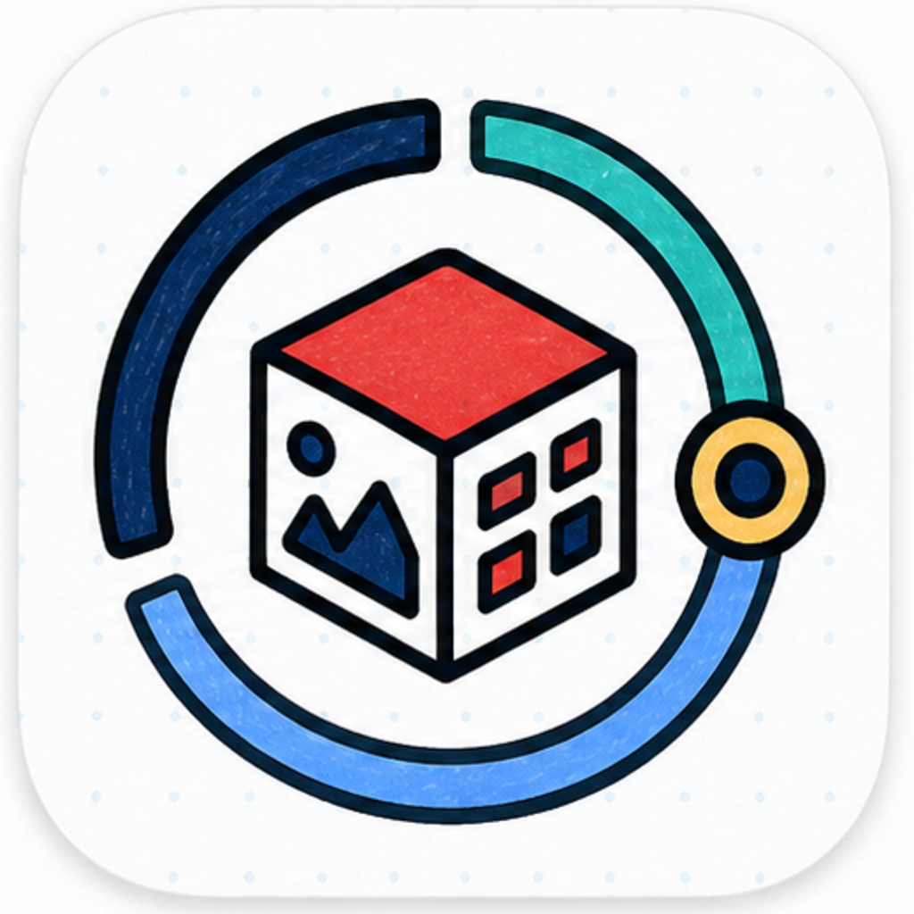
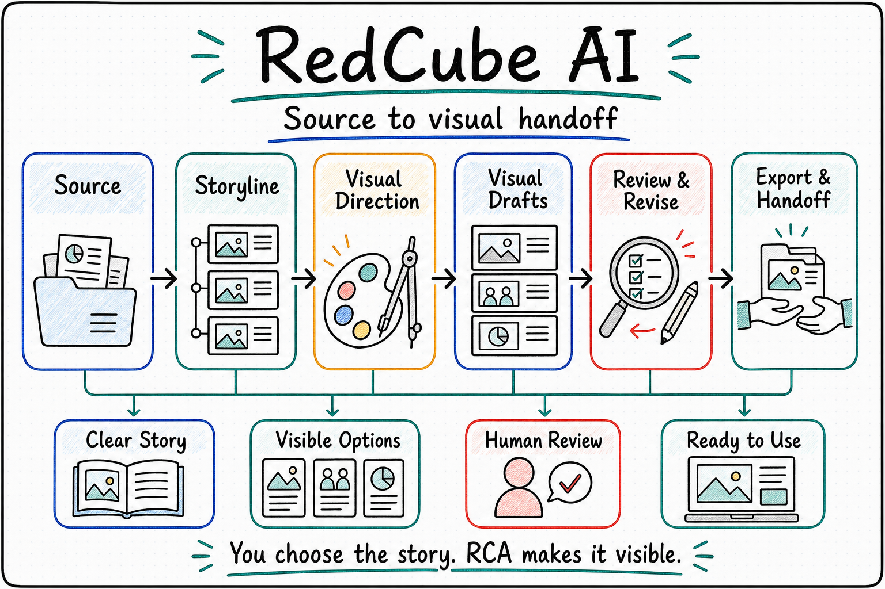

  

# RedCube AI

  <a href="./README.md">English</a> | <a href="./README.zh-CN.md"><strong>中文</strong></a>

<!--
Owner: `RedCube AI`
Purpose: `public_repository_entry_zh_cn`
State: `current_public_entry`
Machine boundary: 人读公开入口。机器真相继续归 contracts、schemas、source、CLI/MCP/API 行为、runtime artifacts、owner receipts、artifact locator 与 RCA-owned review/export gates。
-->

<strong>面向正式视觉交付的 AI 创作工作台 —— 把资料、生成、审阅、回修和导出文件放在同一条可追踪的交付线上。</strong>

幻灯片 · 小红书笔记 · 海报

当一项工作从“帮我做几页图”变成“做一套可以正式使用的视觉交付物”时，问题通常不在单张图片，而在完整流程：

- 源材料、讲稿、截图、参考图和旧版草稿分散在多处，怎么收成一套成品？
- 生成了很多版本后，哪一轮解决了什么审阅意见，哪一轮应该重跑？
- 幻灯片、小红书笔记和海报的路线不同，能不能按成品类型选择合适的创作方式？
- 长时间生成、审阅和导出过程中，用户能不能随时看懂当前进度？
- 最后交付时，导出文件、审阅记录和源材料能不能对得上？

`RedCube AI` 正是围绕这些问题设计的。它面向知识型视觉交付，把源材料整理、页面生成、审阅回修、进度反馈和导出证据放在同一条交付线上，让视觉成品从草稿推进到可以交付的文件。

它不会把视觉交付简化成“生成一张图”。一个成品往往需要多个视觉方向、版式比较、素材补齐、审阅回修和最终导出检查。RedCube AI 把这些创作判断和交付证据放在同一条线上，让每一轮修改都能说清楚为什么改、改到了哪里。

<table>
  <tr>
    <td width="33%" valign="top">
      <strong>适用人群</strong> 
      需要把结构化知识做成正式视觉交付物的专家、课题负责人、教师与专业团队
    </td>
    <td width="33%" valign="top">
      <strong>适用问题</strong> 
      资料、草稿、批注、导出结果分散在多处，希望把交付过程收在同一条可追踪交付线上
    </td>
    <td width="33%" valign="top">
      <strong>如何开始</strong> 
      直接说明要做什么成品、已有资料是什么、最后希望交付什么文件
    </td>
  </tr>
</table>

  

## 核心亮点

**围绕交付物持续创作** 
它不是只生成一张图，而是围绕幻灯片、系列笔记、海报等明确成品持续组织材料、生成页面、吸收审阅反馈，并准备最终导出。

**资料到成品在同一工作区** 
讲义笔记、项目摘要、参考文献、截图、旧版草稿和审阅意见会被放到同一条交付线上，方便回看和复用；真实运行产物属于任务工作区，不写回源码 checkout。

**审阅和回修可追踪** 
每轮审阅意见、重跑记录、修改重点和导出结果都保留下来，操作者可以知道当前版本为什么这样改。

**按成品类型选择路线** 
幻灯片、小红书笔记、知识海报有不同默认路线；可编辑 PPTX、HTML 等路线是显式可选路线。

**长任务进度可见** 
在生成、检查、重跑和导出过程中，RCA 的进度与审阅 surface 会暴露当前步骤、剩余问题和下一轮处理重点。

**保留视觉探索和比较空间** 
正式视觉交付常常需要比较多个方向、发现反复失败点、生成变体并做导出检查。RedCube AI 不把创作锁成单一路线，而是让候选、审阅、回修和交付能连续发生。

## 一句话快速启动

你可以直接这样说：

- “把这份讲义笔记和参考文献整理成一套能直接讲课的幻灯片，过程里的进度要可见，最后导出 PPTX/PDF；如果我明确要求可编辑，再走原生 PPTX 路线。”
- “根据这批源材料帮我做一组小红书笔记，告诉我还缺什么素材，并把每一轮审稿意见和修改都留下来。”
- “根据这个项目摘要做一张海报，跟踪修改意见，内容定稿后把最终交付文件导出来。”

## 适合处理的工作

- 把笔记、大纲、参考文献、截图和旧版草稿整理成正式幻灯片、系列笔记和海报类成品。
- 在同一个工作区里持续跟踪多轮审阅、重跑和导出检查。
- 在长时间运行过程中查看人话进度，了解当前步骤和下一轮审阅重点。
- 让导出文件、审阅结果和源材料保持清晰对应关系；可编辑 PPTX 是用户明确要求时启用的专门路线。
- 在同一交付阶段里比较多个视觉方向、发现反复失败点、生成变体、吸收审阅意见并完成导出检查。

## 当前交付重点

- `幻灯片`：教学讲义、学术报告、内部简报、正式汇报。当前默认 PPT 路线是 image-first 整页视觉图生成；HTML 和可编辑原生 PPTX 都是显式可选路线。
- `小红书笔记`：知识传播、科普内容、系列发布。当前默认路线是 GPT-Image-2 生成 3:4 整页 PNG；HTML 仅作为显式维护或确定性网页稿路线。
- `知识海报`：单页知识型视觉交付。
- 学术论文与会议海报方向继续按具体项目评估和硬化。

## 工作方式

- 专家提供源材料、受众预期和最终判断。
- AI 助手负责方向探索、生成、修订、重跑、导出和进度反馈。
- 工作区持续保存任务、审阅状态、重跑记录、artifact refs 和导出结果，方便检查与回看。

## 当前边界

- `RedCube AI` 是独立的视觉交付 Foundry Agent。它对外第一身份是视觉交付：接收材料、分阶段完成视觉创作、审阅、回修、导出和文件交付。
- 在 OPL family 中，RCA 是 domain agent package：RCA 保留视觉交付 authority，OPL 持有通用 runtime、package carrier、generated wrapper 和 hosted surface。
- 对外第一入口是单一 `redcube-ai` 应用技能；`Codex`、`OPL` 和其他通用智能体可以通过这个入口访问稳定能力面。
- 它可以作为 One Person Lab 里的汇报工坊使用，也可以由 Codex 或其他 Agent 直接调用稳定能力入口。
- 它负责材料接收、成品生成、审阅回路、导出和文件式交付。
- 内容界定、受众适配和最终采用由专家把关。
- 外部发布、上传和最终对外交付由人工监督完成。

  
<strong>技术层 OPL / executor 边界</strong>

- `OPL` 可以把 RedCube 作为外部领域智能体托管；这条 hosted path 是内部集成面，不是 RedCube 的对外第一身份。
- 任务启动后，OPL/Temporal 可以负责持久在线调度、唤醒、retry/dead-letter 与 resume；RCA 不内置 daemon、scheduler 或 attempt loop。
- `Codex CLI` 是 RCA 当前唯一物化的 executor；其他 executor 的 hosted selection、attempt ledger 与回执归 OPL owner surface。
- RedCube 保留视觉交付权威：视觉领域真相、review/export gates、标准产物、文件交接和 owner receipts。
- 完整入口 taxonomy、service-safe domain entry、generated-wrapper 边界、合同 refs、canary evidence 和 no-readiness 规则由 [文档索引](./docs/README.md)、[当前状态](./docs/status.md)、[架构](./docs/architecture.md)、[硬约束](./docs/invariants.md)、[关键决策](./docs/decisions.md) 和 [合同说明](./contracts/README.md) 维护。

## 这个仓库应该怎么读

1. 潜在用户先读当前首页，再继续看 [文档索引](./docs/README.md)。
2. 技术规划、架构判断和方向同步，继续读 [项目概览](./docs/project.md)、[当前状态](./docs/status.md)、[架构](./docs/architecture.md)、[硬约束](./docs/invariants.md)、[关键决策](./docs/decisions.md) 以及 [合同说明](./contracts/README.md)。
3. 开发者和维护者继续从 [文档索引](./docs/README.md) 进入 `docs/active/`、`docs/references/` 与 `docs/policies/`。

## 给 Agent 和技术操作者的快速入口

  
<strong>如果你准备把这个仓直接交给 Codex 或其他 Agent，先看这里</strong>

- 单独 clone 这个仓不会安装 OPL Framework 或托管运行时。需要 hosted execution 时，先准备当前 `one-person-lab` checkout 或 release bundle。
- 先读 [文档索引](./docs/README.md)，再读 [合同说明](./contracts/README.md)、[项目概览](./docs/project.md)、[当前状态](./docs/status.md)、[架构](./docs/architecture.md)、[硬约束](./docs/invariants.md) 和 [关键决策](./docs/decisions.md)。
- 把公开 package 读作 `RedCube AI Foundry Agent`：一个 app skill 和一个 service-safe domain entry，加上 OPL-generated wrapper/projection refs，视觉领域真相继续留在 RCA。
- RedCube direct path 与 OPL-hosted path 必须回到同一套 RedCube-owned route、review、artifact 和 export surfaces。
- 当前 repo-local 命令、命令 target 与验证矩阵由文档索引、contracts 和 `scripts/test-registry.ts` 维护；Agent 不需要先从零散实现文件里反推当前执行真相。
- `docs/active/` 用来读当前 baton，`docs/references/` 用来读当前支撑参考，`docs/history/` 用来读已吸收里程碑、proof 记录、tombstone 和 provenance。

## 延伸阅读

- [文档索引](./docs/README.md)
- [项目概览](./docs/project.md)
- [当前状态](./docs/status.md)
- [架构](./docs/architecture.md)
- [硬约束](./docs/invariants.md)
- [关键决策](./docs/decisions.md)
- [合同说明](./contracts/README.md)
