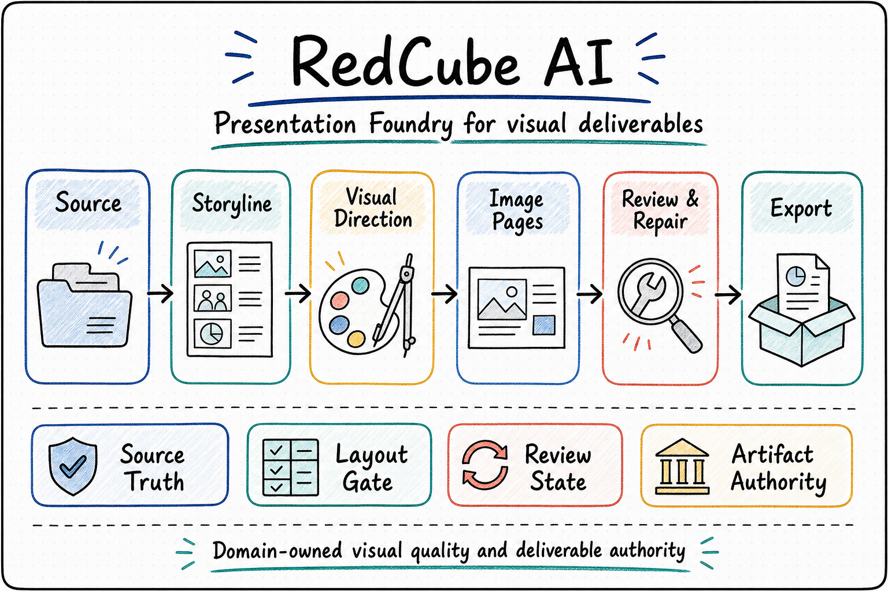

  

# RedCube AI

  <a href="./README.md">English</a> | <a href="./README.zh-CN.md"><strong>中文</strong></a>

<!--
Owner: `RedCube AI`
Purpose: `public_repository_entry_zh_cn`
State: `current_public_entry`
Machine boundary: 人读公开入口。机器真相继续归 contracts、schemas、source、CLI/MCP/API 行为、runtime artifacts、owner receipts、artifact locator 与 RCA-owned review/export gates。
-->

<strong>面向视觉交付的 Foundry Agent，以 built on OPL Framework 的 OPL-compatible package 形态发布</strong>

幻灯片 · 小红书笔记 · 海报

<table>
  <tr>
    <td width="33%" valign="top">
      <strong>适用人群</strong> 
      需要把结构化知识做成正式视觉交付物的专家、课题负责人、教师与专业团队
    </td>
    <td width="33%" valign="top">
      <strong>适用问题</strong> 
      资料、草稿、批注、导出结果分散在多处，希望把交付过程收在同一个工作区里
    </td>
    <td width="33%" valign="top">
      <strong>如何开始</strong> 
      直接说明要做什么成品、已有资料是什么、最后希望交付什么文件
    </td>
  </tr>
</table>

  

> `RedCube AI` 是 RedCube Foundry Agent：它把源材料、生成过程、审阅轮次、进度反馈和导出文件放在同一条交付线上；发布形态统一为单一 `redcube-ai` app skill、service-safe domain entry、sidecar / projection 和 stage control projection。

## 一句话快速启动

你可以直接这样说：

- “把这份讲义笔记和参考文献整理成一套能直接讲课的幻灯片，过程里的进度要可见，最后导出 PPTX/PDF；如果我明确要求可编辑，再走原生 PPTX 路线。”
- “根据这批源材料帮我做一组小红书笔记，告诉我还缺什么素材，并把每一轮审稿意见和修改都留下来。”
- “根据这个项目摘要做一张海报，跟踪修改意见，内容定稿后把最终交付文件导出来。”

## 适合处理的工作

- 把笔记、大纲、参考文献、截图和旧版草稿整理成正式幻灯片、系列笔记和海报类成品。
- 在同一个工作区里持续跟踪多轮审阅、重跑和导出检查。
- 在长时间运行过程中查看人话进度，了解当前步骤和下一轮审阅重点。
- 让导出文件、审阅结果和源材料保持清晰对应关系；可编辑 PPTX 是用户明确要求时启用的专门路线。

## 当前交付重点

- `幻灯片`：教学讲义、学术报告、内部简报、正式汇报。当前默认 PPT 路线是 image-first 整页视觉图生成；HTML 和可编辑原生 PPTX 都是显式可选路线。
- `小红书笔记`：知识传播、科普内容、系列发布。当前默认路线是 GPT-Image-2 生成 3:4 整页 PNG；HTML 仅作为显式维护或确定性网页稿路线。
- `知识海报`：单页知识型视觉交付。
- 学术论文与会议海报方向继续按具体项目评估和硬化。

## 工作方式

- 专家提供源材料、受众预期和最终判断。
- AI 助手负责生成、修订、重跑、导出和进度反馈。
- 工作区持续保存任务、审阅状态、重跑记录和最终文件，方便检查与回看。

## 当前边界

- `RedCube AI` 是独立的视觉交付 Foundry Agent。它对外第一身份是视觉交付：接收材料、分阶段完成视觉创作、审阅、回修、导出和文件交付。
- 公开发布形态：`RedCube AI Foundry Agent`，一个 built on OPL Framework 的 OPL-compatible package。这个 package 由单一 `redcube-ai` app skill、service-safe domain entry（`invokeDomainEntry`）、product sidecar / projection surface 和只读 stage control projection 组成。
- 对外第一入口是单一 `redcube-ai` 应用技能；`status` / `invoke` / `session` 继续作为这个技能下面的机器可读命令合同。其中 `status` 指面向智能体的产品入口概览、材料接收和入口壳，不代表已经落地 GUI、WebUI 或最终用户前台。
- 它对外稳定暴露的可调用面是本地 CLI、MCP / 产品入口命令、`invokeDomainEntry`、本地脚本与仓库跟踪合同，方便 `Codex` 或其他操作者直接调用。
- 它负责材料接收、成品生成、审阅回路、导出和文件式交付。
- RedCube 的 public executor backend contract 只认 `codex_cli` 与 `hermes_agent`；`execution_shape` 另行声明为 `structured_call` 或 `agent_loop`。
- 实现语言目标是 `TypeScript + Python`：TypeScript 管 product/runtime contract 与 service boundary，Python 在 RedCube route/gate 下承担 native PPT/Office helper 与文档/PPT 修复循环。
- 内容界定、受众适配和最终采用由专家把关。
- 外部发布、上传和最终对外交付由人工监督完成。

  
<strong>技术层 OPL / executor 边界</strong>

- `OPL` 是 stage-led 的完整智能体运行框架，可以把 RedCube 作为外部领域智能体托管；这条路径是内部集成 / 托管运行路径，不是 RedCube 的对外第一身份。
- 当 OPL 托管 RedCube 时，Agent executor 是最小具体执行单位；除非显式选择 hosted/proof 后端，当前第一公民 executor 是 `Codex CLI`。
- Hermes-Agent 等其他 executor 是 opt-in adapter。RedCube 对这些 adapter 只承诺接入、生命周期、回执和审计面成立，不默认承诺行为或输出质量与 Codex CLI 等价。
- 直达路径和 OPL 托管路径都必须收敛到同一个下游 RedCube 领域智能体入口（`invokeDomainEntry` service-safe surface）。
- RedCube 持有视觉交付阶段包、提示词、技能、审阅门、视觉领域真相、标准产物和导出权威。OPL 可以提供排队、唤醒、交接、回执、重试 / 死信和投影支撑，但不会成为视觉领域大脑或产物所有者。

## 这个仓库应该怎么读

1. 潜在用户先读当前首页，再继续看 [文档索引](./docs/README.md)。
2. 技术规划、架构判断和方向同步，继续读 [项目概览](./docs/project.md)、[当前状态](./docs/status.md)、[架构](./docs/architecture.md)、[硬约束](./docs/invariants.md)、[关键决策](./docs/decisions.md) 以及 [合同说明](./contracts/README.md)。
3. 开发者和维护者继续从 [文档索引](./docs/README.md) 进入 `docs/active/`、`docs/references/` 与 `docs/policies/`。

## 给 Agent 和技术操作者的快速入口

  
<strong>如果你准备把这个仓直接交给 Codex 或其他 Agent，先看这里</strong>

- 先读 [文档索引](./docs/README.md)。这里已经说明 RedCube 直达路径、OPL 托管集成路径、稳定能力面，以及当前技术基线。
- 然后读 [合同说明](./contracts/README.md)，再读 [项目概览](./docs/project.md)、[当前状态](./docs/status.md)、[架构](./docs/architecture.md)、[硬约束](./docs/invariants.md) 和 [关键决策](./docs/decisions.md)，再决定是否调整入口 wording 或集成表述。
- 把公开 package 读作 `RedCube AI Foundry Agent`：一个 built on OPL Framework 的 OPL-compatible package；它发布一个 app skill、一个 service-safe domain entry、product sidecar / projection refs 和 stage-control projection metadata，同时把 domain truth 留在 RCA。
- 当前已验证的公开入口面是单一 `redcube-ai` 应用技能、`CLI` 和 `MCP`，`controller` 继续只是内部控制面；再加上 `invokeDomainEntry`、`invokeProductEntry`、本地脚本与仓库跟踪合同，就构成了稳定可调用面。本地默认具体执行器仍是 `Codex CLI`，hosted/proof 后端继续只在显式选择时出现。
- RedCube 可以通过 Codex 应用技能直接调用，也可以作为外部领域智能体被 OPL 托管调用。两条路径必须回到同一套 RedCube 持有的 route、review、artifact 和 export surface。
- Agent 应把实现面理解为 TypeScript orchestration 加 Python native helpers。仓内已跟踪 JavaScript 已退役；新的产品、测试或脚本 JavaScript 会被 closeout audit 阻断。
- 如果外部智能体或 OPL 需要直接读取仓库跟踪的技能面，使用单一 `redcube-ai` 应用技能，并通过 `npm run --prefix <redcube-ai-repo> redcube -- ...` 启动 CLI 命令；`status` / `invoke` / `session` 继续作为这个技能下面的机器可读命令合同。`redcube product status` 是当前 product overview 命令，语义是产品入口概览 / 材料接收壳，不代表成熟的人用 GUI 或 WebUI；OPL 托管路径仍然只是内部集成面。
- 测试 lane 真相放在 `scripts/test-registry.ts`，当前验证矩阵以 [当前状态](./docs/status.md) 为准。`smoke` 是最小本地入口，`fast` 是核心回归快线，hosted CI 等价于 `npm run test:ci`，`historical` 只在显式要求时运行。
- `docs/active/` 用来读当前 baton，`docs/references/` 用来读当前支撑参考，`docs/history/` 用来读已吸收里程碑、proof 记录、tombstone 和 provenance；Agent 不需要先从零散实现文件里反推当前执行真相。

## 延伸阅读

- [文档索引](./docs/README.md)
- [项目概览](./docs/project.md)
- [当前状态](./docs/status.md)
- [架构](./docs/architecture.md)
- [硬约束](./docs/invariants.md)
- [关键决策](./docs/decisions.md)
- [合同说明](./contracts/README.md)
